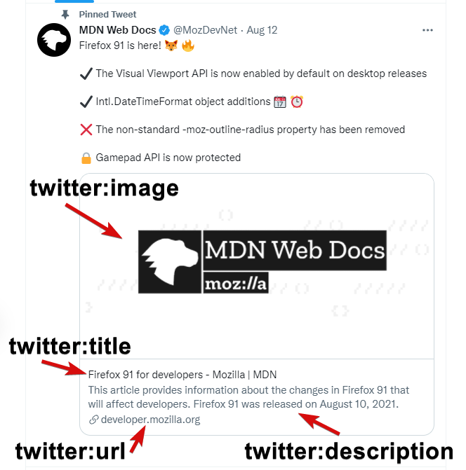

# Advanced Metadata Activity
In this activity, you will apply advanced metadata properties to a web page to improve search engine optimization and learn how to make a web page more friendly to share on social media.

## Activity Objectives
1. Add basic metadata.
2. Add metadata for browsers.
3. Add metadata designed for Twitter.
4. Add metadata designed for Facebook/Open Graph.

## HTML Directions
1. Open the `index.html` file within the root of the repo.
2. Add the language attribute to the HTML start tag.
3. Add the following metadata content under the comment that says `Add standard metadata below this comment`:
   1. Add a meta element to define the character set as `UTF-8`.
   2. Define the viewport properties for the site by adding a meta element with a name of `viewport` and a content value of `width=device-width, initial-scale=1.0`.
   3. Update the page title to read `Lesson 5 Metadata`.

> The character set and viewport metadata properties should be the first things that are defined within the `head` element. This will ensure that the browser knows how to interpret the characters and sets up the viewport appropriately for users, which can be important for mobile devices and for accessibility reasons.

4. Save and apply a commit to the file.
5. Add the following metadata content under the comment that says `Add browser and search engine metadata below this comment`:
   1. Define yourself as the `author`.
   2. Add a page `description`.
   3. Add page `keywords`.
   4. Tell search engine `robots` to index the page to be searchable and allow them to follow any links found on the page with a content value of `index,follow`.
      1. You can define the same thing specifically for Google by adding another meta tag that uses the name of `googlebot`.
   5. Tell Google not to translate a page, which can be helpful if you have a page with different foreign languages on it, by use a name value of `google` and a content value of `notranslate`.
   6. To improve your site for safe search optimizations, include a `rating` with a content value of `general`.
      1. If you are working on a site with adult content, you should identify it as such to allow search engines to filter out the site based upon the user's search preferences. See [All meta tags that Google understands](https://developers.google.com/search/docs/advanced/crawling/special-tags) for more details.
   7. Force old versions of Internet Explorer (IE) - 8/9/10 - to use its latest rendering engine by adding the attribute `http-equiv` with a value of `x-ua-compatible` and a content value of `ie=edge`. 
      1. If you have to support IE in a project, then this will help make sure the browser is supporting more modern standards, though it will still not support many modern methods and you will need to use fallback techniques.
6. Save and apply a commit to the file.

### Add Open Graph/Facebook Metadata
Open Graph requires four properties to be defined at a minimum to function properly, but more can be defined when needed. These properties are related to the card-like component that appears in Facebook posts when a user shares a URL to a website, video, audio, image, etc. The four are `title`, `type`, `image`, and `url`.

Up until now, when you defined metadata for the page you utilizes the `name` and `content` attributes to define the metadata. *Open Graph* adjusts this slightly in that it utilizes the `property` attribute instead of the `name` attribute. Also, the value for the `property` attribute must start with `og:`. Therefore, to construct metadata for *Open Graph* you will need to construct it following this pattern:
```html
<meta property="og:propertyValue" content="contentValue">
```

1. Add the following metadata content under the comment that says `Add Open Graph/Facebook metadata below this comment`:
   1. Define the `type` property value to establish what the content being shared is using a content value of `website`.
   2. Define the `title` property value with a content value that matches the heading or title of the page.
   3. Define the `url` property value with a content value of the page URL.
   4. Define the `image` property value with the content value being the URL for the image to be used when creating the Facebook entry. Use the `SocialMediaImage.jpg` within the `images` folder.
   5. Define the optional `description` property value with a content value that describes the web page.
2. Save and apply a commit to the file.

> We are not covering all the potential metadata properties in this practice activity, just the most essential. You can review all the available metadata properties via the [The Open Graph protocol](https://ogp.me/) website.

The following image is an example of how metadata will be used to create a Facebook post when someone shares the URL.


### Add Twitter Metadata
Twitter calls their components "cards" with the types of cards being `summary`, `photo`, `video`, `product`, `app`, `gallery`, and `large version`. Twitter requires you to define the type of card you want to use when the content of the web page is shared within a tweet. Also, Twitter provides the ability to attribute the content to a website and/or individual person using the `site` and `creator` metadata properties respectively.

When constructing metadata for Twitter, the `name` attribute will need to start with `twitter:` and then the name of the metadata. e.g., `twitter:site` Therefore, to construct metadata for *Twitter* you will need to construct it following this patter:
```html
<meta name="twitter:nameValue" content="contentValue">
```

1. Add the following metadata content under the comment that says `Add Twitter metadata below this comment`:
   1. Create a Twitter card with the `card` name value with a content value of `summary`.
   2. Define the `site` name value for the card with a content value of a Twitter handle. 
      1. For example, `@RioSaladoOnline` could be a value.
   3. Define the `creator` for the card. 
      1. If you have a Twitter account, you can utilize your own handle as the content value. 
      2. If you do not have an account, you can utilize `@gordoninman` as the content value.
2. Save and apply a commit to the file.

> It should be noted that *Twitter* will recognize some *Open Graph* metadata that they have in common that you may have already defined allowing you to reduce the number of duplicating meta elements. For example, the `title`, `description`, `url`, and `image`. Since these were defined earlier in the *Open Graph* section of the activity, we are not defining them again for *Twitter*.

> We will not cover all the potential metadata properties in this practice activity, just the most essential. You can review all the available metadata properties via the [About Twitter Cards](https://developer.twitter.com/en/docs/twitter-for-websites/cards/overview/abouts-cards) article.

The following image is an example of how the metadata will be used to create a Twitter card when someone shares the URL via a tweet.



## Conclusion
When you are done with the activity:
1. Be sure you check for any validation errors and correct them.
2. Sync the files (i.e., push your changes) with the remote repo on GitHub.